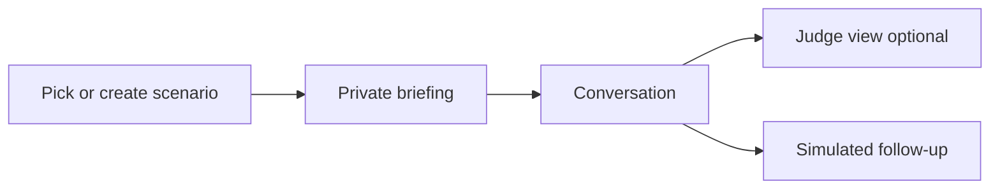
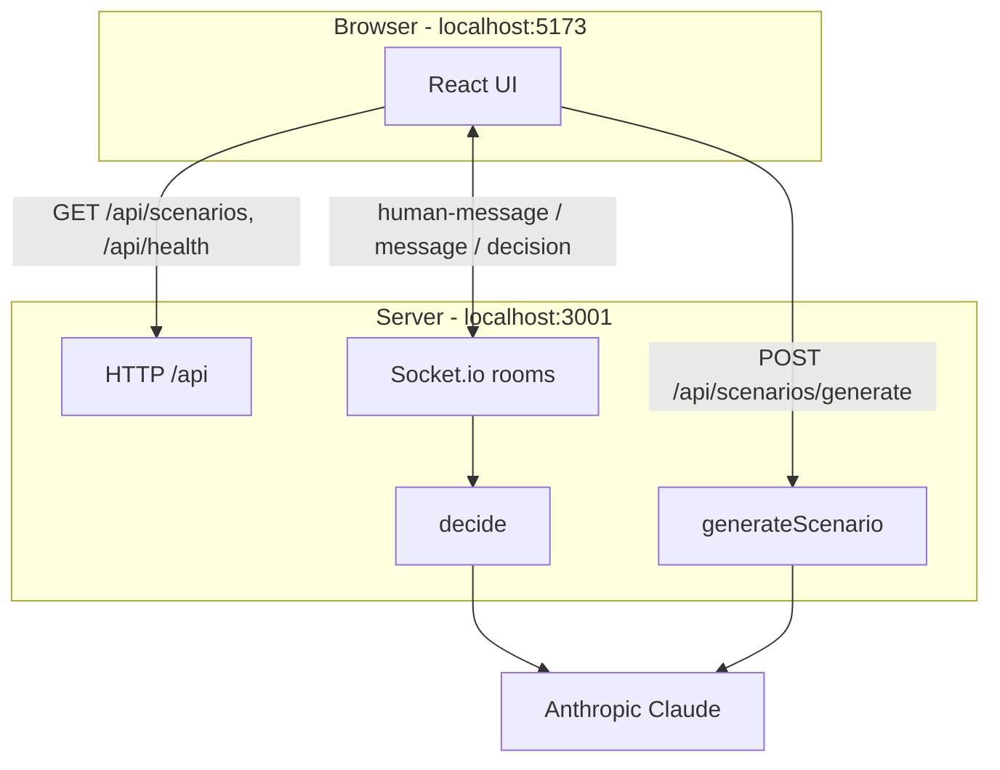
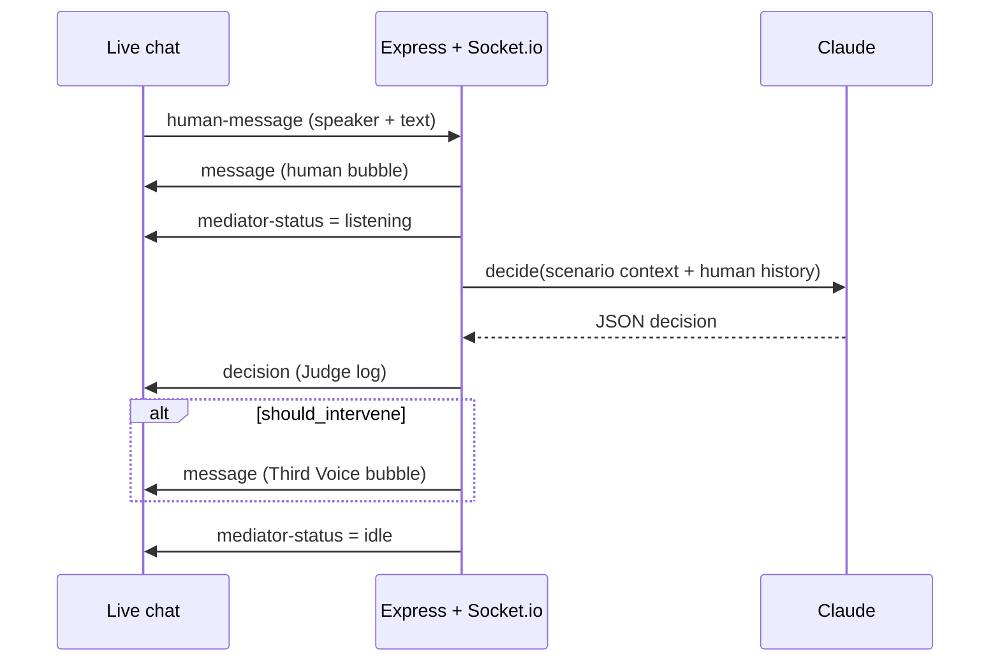

# The Third Voice

A low-key AI that **observes** workplace 1:1s and speaks only when a short, neutral reframe can help — silence is the default.

## The problem we are trying to solve

Hard workplace conversations often fail for predictable reasons:

- **Facts stay offstage** — shipped work, scope changes, or open promotion slots never get named in the moment
- **Premature closure** — “budget is tight” or “figure it out yourself” ends the talk too early
- **Fear and blame** — juniors stop asking for help; deadline talks become personal instead of practical
- **No follow-through** — a vague “we’ll revisit this” evaporates after the meeting

Most AI tools add more chat. **The Third Voice** does the opposite: it watches, stays quiet when people are making progress, and intervenes only with a short question or next step — never a verdict.

| Scenario seed | Real-world pain |
|---------------|-----------------|
| The Raise Conversation | Recognition talks freeze on “no budget” |
| The Missed Deadline | Blame instead of a revised plan |
| The Scared Intern | Asking for help feels unsafe |

You can also **Create your own** scenario from a short description.

---

## Anthropic API key (required for AI)

You need an **Anthropic API key** for the mediator and custom scenario generation to work.

1. Create a key at [console.anthropic.com](https://console.anthropic.com/)
2. Copy `.env.example` → `.env`
3. Set the key:

```bash
ANTHROPIC_API_KEY=sk-ant-api03-your-key-here
```

| Without key | With key |
|-------------|----------|
| Chat still works | Claude decides after each human message |
| Judge log: “No API key configured…” | Interventions + full reasoning |
| Custom scenario generation fails | “Create your own” works |

> Restart `npm run dev` after changing `.env`. Editing the file alone does not reload env vars.

---

## Quick start

**Requirements:** Node.js 20+, npm

```bash
# 1. Install dependencies
npm install

# 2. Configure the API key
cp .env.example .env
# then edit .env and paste ANTHROPIC_API_KEY=...

# 3. Start client + server together
npm run dev

# 4. Open the app
# http://localhost:5173
```

| Process | URL |
|---------|-----|
| Vite UI | http://localhost:5173 |
| Express + Socket.io API | http://localhost:3001 |

Stop with `Ctrl+C`. If you see `EADDRINUSE` on port 3001, an old server is still running:

```bash
lsof -tiTCP:3001 -sTCP:LISTEN | xargs kill
npm run dev
```

---

## How to use the app



1. **Landing** — choose a seed scenario, or **Create your own** (needs API key).
2. **Briefing** — each side gets a private nudge + background evidence. Reveal both (or open Judge view) to continue.
3. **Conversation**
   - **Scripted** — click **Play next line** for a reliable solo demo.
   - **Live mode** — pick a speaker, type freely; open a second tab for a two-person demo (same scenario room).
4. **Judge view** — every turn’s decision: `INTERVENED` or `SILENT`, with reasoning.
5. **Follow-up** — simulated one-week check on the commitment (not wired to Slack/Jira).

## Enhancements

- Tone dots show the Third Voice's read of each human message.
- Intervention cards show calibrated confidence; Judge view explains the basis.
- Escalation flags create an exportable, plain-language Markdown summary.
- Every fourth turn, the Third Voice self-checks its recent framing for potential bias.
- Custom scenario creation supports Chrome voice dictation when available.

---

## How it works (architecture)



### Live message loop



Chat does **not** use a REST “chat” endpoint. Human lines and AI replies travel over **Socket.io**. The browser never calls Anthropic directly — only the server does.

---

## Project layout

```
.
├── .env.example          # ANTHROPIC_API_KEY=
├── client/               # React + Vite UI
├── server/
│   ├── seed-data/        # Built-in scenario JSON
│   └── src/
│       ├── index.ts      # Express + Socket.io
│       ├── constants/prompts.ts
│       └── services/llmMediator.ts
└── package.json
```

---

## Scripts

| Command | Purpose |
|---------|---------|
| `npm run dev` | Local UI + API with hot reload |
| `npm run build` | Compile server + build client |
| `npm start` | Run compiled server (`server/dist`) |

---

## Notes & limits (MVP)

- Scenarios live in local JSON; sessions are **in-memory** (lost on restart).
- No database, auth, or Slack/GitHub/Jira integrations yet.
- Follow-up screen is **simulated** on purpose.
- If Claude’s response cannot be parsed after one retry, the conversation continues and Judge view records why the Third Voice stayed silent.
