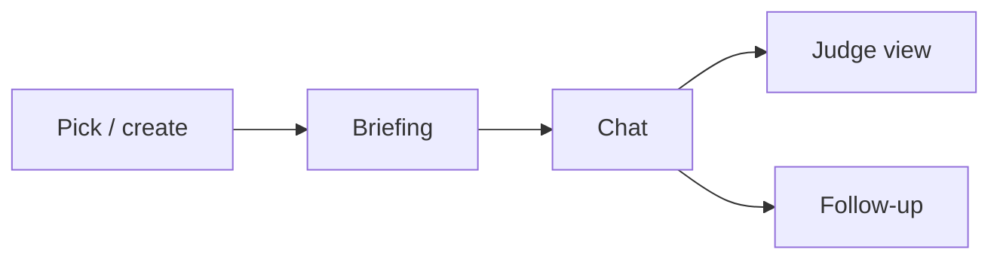
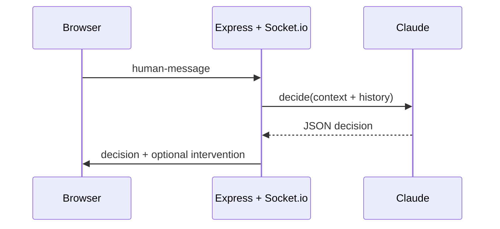

# The Third Voice

A low-key AI that watches workplace 1:1s and speaks only when a short, neutral reframe helps. **Silence is the default.**

Hard conversations fail when facts stay offstage, talks close too early, fear replaces curiosity, or commitments evaporate. Most AI tools add more chat. This one intervenes rarely — as a question or next step, never a verdict.

**Demo scenarios:** Raise Conversation · Missed Deadline · Scared Intern · Create your own

---

## Quick start

**Needs:** Node.js 20+, an [Anthropic API key](https://console.anthropic.com/)

```bash
npm install
cp .env.example .env   # set ANTHROPIC_API_KEY=...
npm run dev
```

Open **http://localhost:5173** (API on `:3001`). Restart after changing `.env`.

If port 3001 is busy: `lsof -tiTCP:3001 -sTCP:LISTEN | xargs kill`

| Command | Purpose |
|---------|---------|
| `npm run dev` | UI + API locally |
| `npm run build` | Production build |
| `npm start` | Run compiled server |

---

## How to use



1. Pick a seed scenario or **Create your own**
2. Reveal private briefings → continue
3. **Scripted** (Play next line) or **Live** (type freely; two tabs share a room)
4. **Judge view** logs every `INTERVENED` / `SILENT` decision
5. Simulated one-week follow-up on the commitment

Optional: set `SLACK_BOT_TOKEN` + `SLACK_SIGNING_SECRET` to bridge Slack Events to the same mediator (`/slack/events`).

---

## How it works



Chat runs over **Socket.io** (not a REST chat endpoint). Only the server talks to Anthropic.

---

## MVP limits

- Local JSON seeds; sessions are in-memory
- Follow-up is simulated
- No auth / database
- Missing API key → chat still works; mediator stays silent

---

Built with [Codex](https://openai.com/codex).
